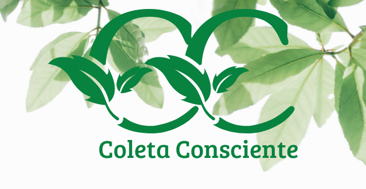

<h1 align="center">
    
</h1>

<h4 align="center">
  🚀 Coleta Consciente
</h4>

  <a href="#-projeto">Projeto</a>&nbsp;&nbsp;&nbsp;|&nbsp;&nbsp;&nbsp;
  <a href="#-tecnologias">Tecnologias</a>

		 

	
  

  
  

# 🥇 Contribuidores
Contribuidores do projeto Coleta Consciente.

[ <b>Gabriel Mendes</b>](https://www.linkedin.com/in/gabriel-mendes-a818bb19b/)  [💻](https://github.com/gabrielsmm/adjobs "Developer") [📖](https://github.com/gabrielsmm/adjobs "Documentation")

## 💻 Projeto

- [Projeto Navegável](https://coletaconsciente.netlify.app)

## 🚀 Tecnologias

Esse projeto foi desenvolvido com as seguintes tecnologias:

- [Angular](https://angular.io)
- [Spring](https://spring.io)
- [PostgreSQL](https://www.postgresql.org)
- [H2 Database](https://www.h2database.com/html/main.html)
- [TypeScript](https://www.typescriptlang.org)
- [Java](https://www.java.com/pt-BR/)